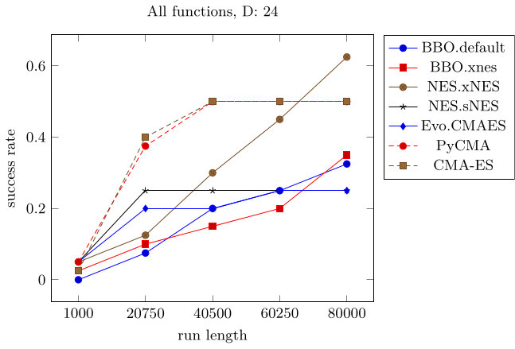
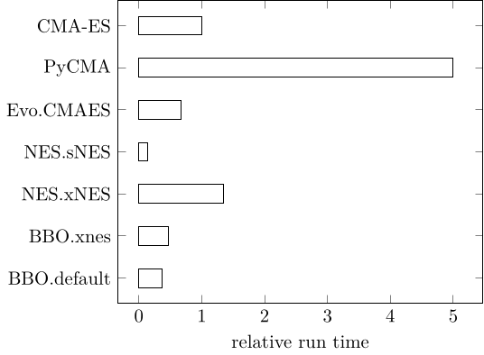

# CMAEvolutionStrategy.jl

<!--
-->
<!--


 -->
[](https://travis-ci.com/jbrea/CMAEvolutionStrategy.jl)
[](http://codecov.io/github/jbrea/CMAEvolutionStrategy.jl?branch=master)
<!--[](https://jbrea.github.io/CMAEvolutionStrategy.jl/stable)
[](https://jbrea.github.io/CMAEvolutionStrategy.jl/dev)
-->

The CMA Evolution Strategy is a stochastic method for derivative-free
optimization of potentially non-linear, non-convex or noisy functions over
continuous domains ([Hansen 2016](https://arxiv.org/abs/1604.00772)).
A brief discussion of its performance in practice can be found on
[wikipedia](https://en.wikipedia.org/wiki/CMA-ES#Performance_in_practice).

The default settings and implementation details follow closely
[Hansen 2016](https://arxiv.org/abs/1604.00772) and
[pycma](https://github.com/CMA-ES/pycma).


## Example
```julia
julia> function rosenbrock(x)
           n = length(x)
           sum(100 * (x[2i-1]^2 - x[2i])^2 + (x[2i-1] - 1)^2 for i in 1:div(n, 2))
       end

julia> using CMAEvolutionStrategy

julia> result = minimize(rosenbrock, zeros(6), 1.)
(4_w,9)-aCMA-ES (mu_w=2.8,w_1=49%) in dimension 6 (seed=17743412058849885570, 2020-05-12T16:22:27.211)
  iter   fevals   function value      sigma   time[s]
     1        9   6.06282462e+02   8.36e-01     0.008
     2       18   6.00709117e+02   8.42e-01     0.009
     3       27   2.40853796e+02   7.84e-01     0.009
   100      900   8.25748973e-01   1.44e-01     0.021
   200     1800   2.21358637e-05   1.12e-02     0.040
   266     2394   5.58767672e-12   2.76e-05     0.051
Optimizer{Parameters,BasicLogger,Stop}
(4_w,9)-aCMA-ES (mu_w=2.8,w_1=49%) in dimension 6 (seed=17743412058849885570, 2020-05-12T16:22:27.254)
  termination reason: ftol = 1.0e-11 (2020-05-12T16:22:27.255)
  lowest observed function value: 1.076905008476142e-12 at [0.9999990479016964, 0.9999981609497738, 0.9999990365312236, 0.9999981369588251, 0.9999994689450983, 0.9999988356249463]
  population mean: [1.000000255106133, 1.0000004709845969, 1.0000006232562606, 1.0000012290059055, 0.9999998790530266, 0.9999997338544545]

julia> xbest(result)
6-element Array{Float64,1}:
 0.9999990479016964
 0.9999981609497738
 0.9999990365312236
 0.9999981369588251
 0.9999994689450983
 0.9999988356249463

julia> fbest(result)
1.076905008476142e-12

julia> population_mean(result)
6-element Array{Float64,1}:
 1.000000255106133
 1.0000004709845969
 1.0000006232562606
 1.0000012290059055
 0.9999998790530266
 0.9999997338544545

help?> minimize
search: minimize

  minimize(f, x0, s0;
           lower = nothing,
           upper = nothing,
           constraints = _constraints(lower, upper),
           noise_handling = nothing,
           popsize = 4 + floor(Int, 3*log(length(x0))),
           callback = (object, inputs, function_values, ranks) -> nothing,
           parallel_evaluation = false,
           multi_threading = false,
           verbosity = 1,
           seed = rand(UInt),
           logger = BasicLogger(x0, verbosity = verbosity, callback = callback),
           maxtime = nothing,
           maxiter = nothing,
           maxfevals = nothing,
           stagnation = 100 + 100 * length(x0)^1.5/popsize,
           ftarget = nothing,
           xtol = nothing,
           ftol = 1e-11)

  Minimize function f starting around x0 with initial covariance s0 * I under box constraints
  lower .<= x0 .<= upper, where x0, lower and upper are vectors of the same length or
  nothing.

  The result is an Optimizer object from which e.g. xbest, fbest or population_mean can be
  extracted.

  If parallel_evaluation = true, the objective function f receives matrices of n rows (n =
  length(x0)) and popsize columns and should return a vector of length popsize. To use
  multi-threaded parallel evaluation of the objective function, set multi_threading = true
  and start julia with multiple threads (c.f. julia manual for the multi-threading
  setup).
```
## Noise Handling

The standard settings may work well for noisy objective functions. To avoid
premature convergence due to too fast decrease of sigma, there is the option
`noise_handling = CMAEvolutionStrategy.NoiseHandler(ασ = 1.1, callback = s -> s > 0)`.
Choose `ασ` such that sigma decreases slowly (and does not diverge). The callback
function can be used to change the objective function, e.g. increase the
measurement duration, if this leads to smaller noise. The variable `s` indicates
whether CMA-ES can handle the current level of noise: `s > 0` indicates that the
noise level is too high. Whenever the callback returns `true`, sigma gets multiplied by
`ασ`, which is the case when `s > 0`, with the default callback.

For details on noise handling see [Hansen 2009](http://dx.doi.org/10.1109/TEVC.2008.924423).
## Benchmarks

Running
[BlackBoxOptimizationBenchmarking](https://github.com/jonathanBieler/BlackBoxOptimizationBenchmarking.jl)
in [24 dimensions](test/bbob.jl), highlights the advantage of CMA-ES early in optimization.
All methods were chained into NelderMead after 90% of the run length (c.f. [BlackBoxOptimizationBenchmarking](https://github.com/jonathanBieler/BlackBoxOptimizationBenchmarking.jl))



CMAES = this package,
BBO = [BlackBoxOptim](https://github.com/robertfeldt/BlackBoxOptim.jl),
NES = [NaturalES](https://github.com/francescoalemanno/NaturalES.jl),
Evo = [Evolutionary](https://github.com/wildart/Evolutionary.jl),
PyCMA = [pycma](https://github.com/CMA-ES/pycma)


